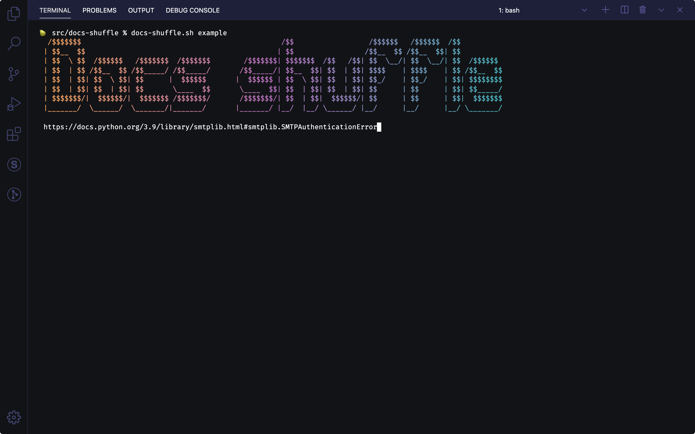

# Docs shuffle 🛳

Go on a cruise through some documentation with this fancy cmdline utlity.

## Screenshot



## How to setup

1. Install dependencies (& build `.go` file)
```shell
npm install
```

2. Run it

```shell
sh docs-shuffler.sh <playlist>

# Run included example (exclude the .csv)
sh docs-shuffler.sh example
```

3. Add some playlists. Use a [link extractor](https://www.iwebtool.com/link_extractor) on the index of the documentation. Copy and paste the links into a csv and save them under the `playlists` folder.

4. Update `docs-shuffle.sh` with your installation path. Note: If you add the path to this script to your $PATH, you can run this shell script from any folder.

